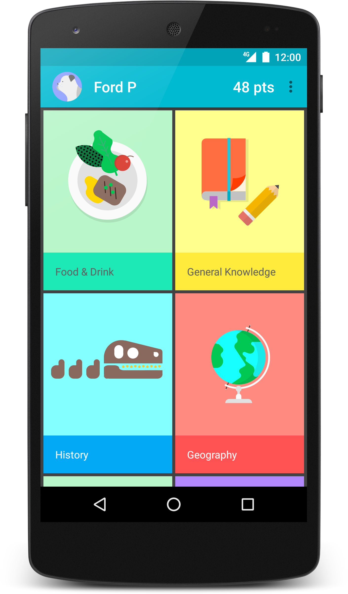
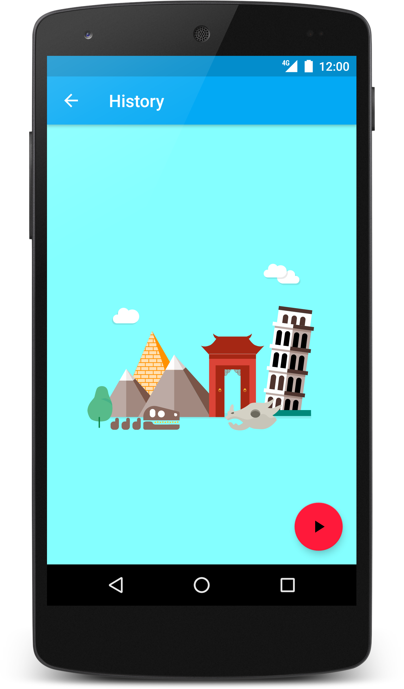
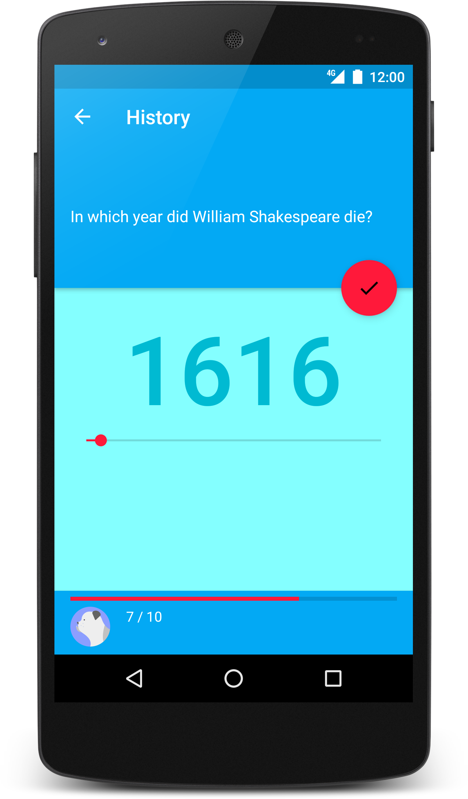

# Topeka for Flutter

A fun to play quiz that showcases material design on Flutter (Android & iOS)

### Introduction

Material design is a new system for visual, interaction and motion design.
The Flutter version of Topeka demonstrates that the same branding and material
design principles can be used to create a consistent experience across
platforms.

This project is based on the [Topeka android app](https://github.com/android/topeka)
as an Open Source example of material design on Android.

### Screenshots

